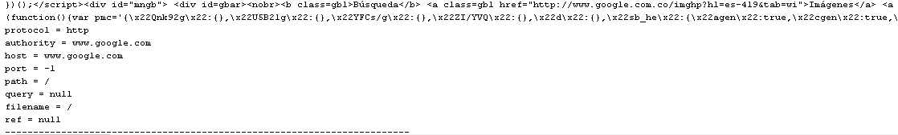
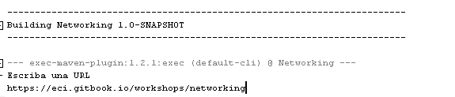
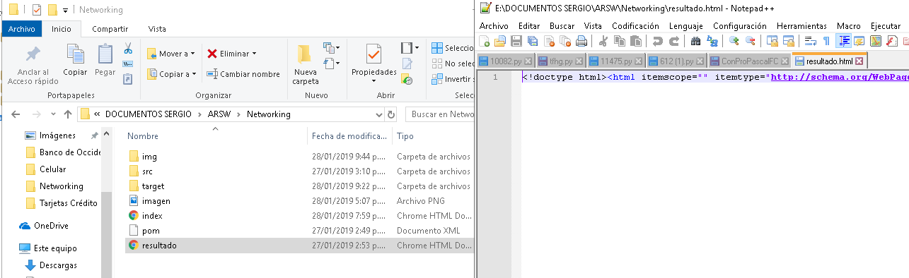
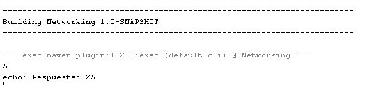
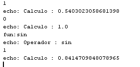
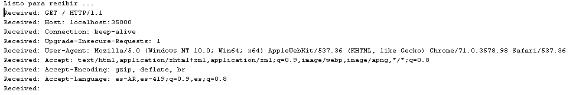
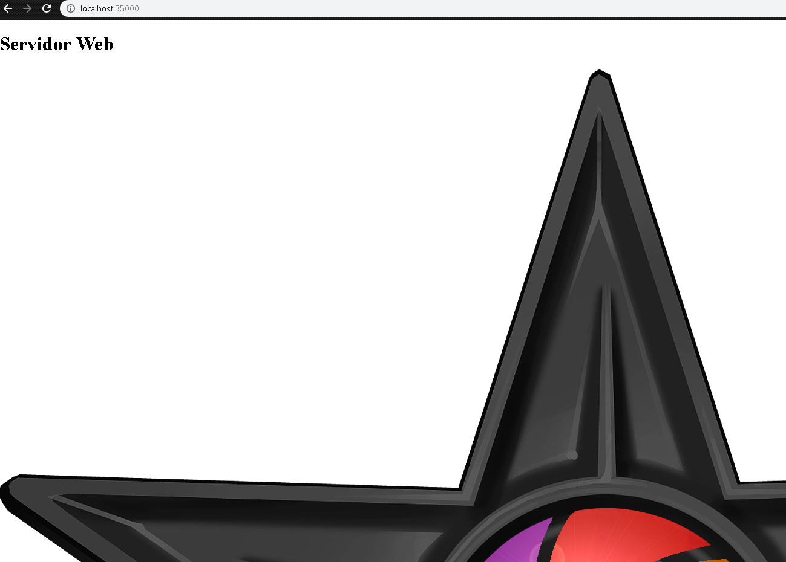
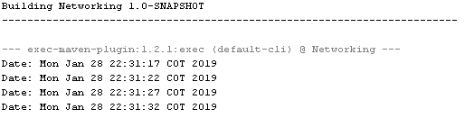

# Laboratorio#2 Arsw

Nombre: 
* Sergio Alejandro Peña Pinto

## *Exercise 1:*
In this exercise you create a URL object and print on the screen the 8 methods that were requested as you can see in the image.

## *Exercise 2:*
In this exercise, you create a browser application that asks a user's URL and reads data from that address and stores it in a file with the name of the resultado.html. Then we open the browser and we can see what happens in the image.

## *Exercise 3:*
In this exercise, a server is created that receives a number and answers the square of this number. As you can see in the picture everything went well.

## *Exercise 4:*
In this exercise you create a server that can receive a number and respond with an operation on this number. This server can receive a message that begins with "fun:", if it receives this message it changes the operation to the speci fi ed ones. The server responds to the sine, cosine and tangent functions. By default it starts calculating the cosine. For example, if the first number it receives is 0, it answers 1, if after it receives 1/2 it responds 0, if then it receives "fun: without" it changes the current operation to sine, that is to say from that moment it calculates sines. If it immediately receives 0 it responds 0. Thus it can be evidenced in the image.

## *Exercise 5:*
In this exercise, a server is created that responds to the client's request and shows the data captured on the screen.

## *Exercise 6:*
In this exercise, a server is created that supports multiple requests in a row (not concurrent). This server returns all requested files, including html pages and images.

## *Exercise 7:*
In this exercise, you create a program that connects to a server that responds to the current time on the server. The program updates the time every 5 seconds according to the server data. If an hour is not received, it keeps the time it had. For the test the server is turned off and after a few seconds it is reactivated. The client keeps running and is updated when the server is back online.

